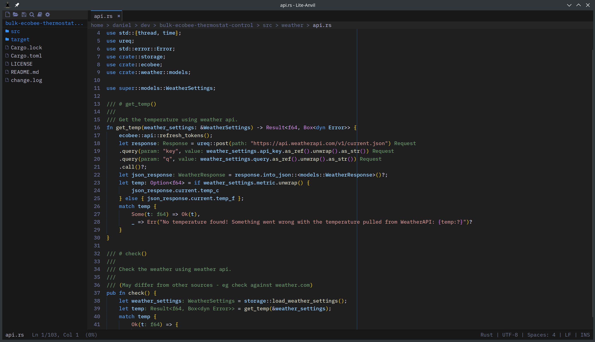
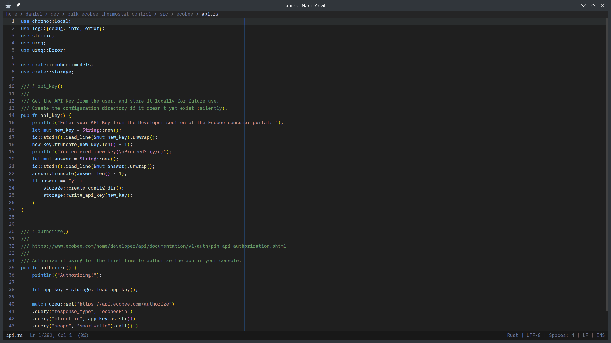
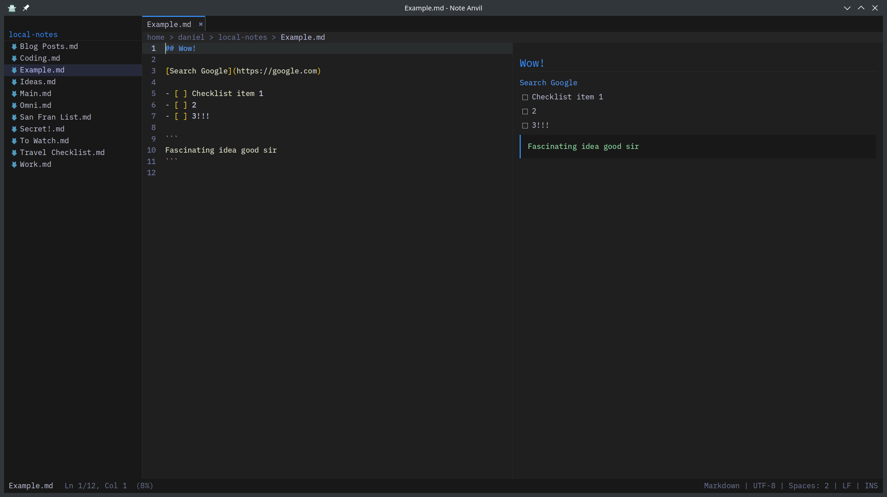

# Screenshots

## Lite Anvil

{ .screenshot }

The full editor: sidebar, tabs, LSP inlay hints, embedded terminal, git integration.

## Nano Anvil

{ .screenshot }

The minimal single-file editor. No sidebar, terminal, LSP, git, or tabs.

## Note Anvil

{ .screenshot }

The markdown note-taking app: sidebar of notes, side-by-side preview, autosave.
